# MER MODELO de Datos Óptica

```mermaid
erDiagram
    ADMINISTRACION_USUARIOS_Empleados {
        bigint ID PK
        nvarchar NOMBRE
        nvarchar APELLIDO
        bigint USUARIO_CREACION
        datetime2 FECHA_CREACION
        bigint USUARIO_ACTUALIZACION
        datetime2 FECHA_ACTUALIZACION
    }

    ADMINISTRACION_USUARIOS_Usuarios {
        bigint ID PK
        bigint EMPLEADO_ID FK
        nvarchar NOMBRE_USUARIO
        varbinary PASSWORD_HASH
        varbinary PASSWORD_SALT
        bit ACTIVO
        datetime2 BLOQUEADO_HASTA
        int INTENTOS_FALLIDOS
        bigint USUARIO_CREACION
        datetime2 FECHA_CREACION
        bigint USUARIO_ACTUALIZACION
        datetime2 FECHA_ACTUALIZACION
    }

    ADMINISTRACION_USUARIOS_Roles {
        bigint ID PK
        nvarchar CODIGO
        nvarchar NOMBRE
    }

    ADMINISTRACION_USUARIOS_UsuariosRoles {
        bigint USUARIO_ID PK, FK
        bigint ROL_ID PK, FK
    }

    ADMINISTRACION_USUARIOS_RefreshTokens {
        bigint ID PK
        bigint USUARIO_ID FK
        varbinary TOKEN_HASH
        datetime2 EXPIRES_AT
        datetime2 REVOKED_AT
    }

    ADMINISTRACION_USUARIOS_LoginAttempts {
        bigint ID PK
        bigint USUARIO_ID FK
        nvarchar NOMBRE_USUARIO
        bit EXITOSO
        datetime2 FECHA_INTENTO
    }

    CATALOGOS_TiposIDentificacion {
        bigint ID PK
        nvarchar NOMBRE
        bit ACTIVO
    }

    CATALOGOS_EstadosOrden {
        bigint ID PK
        nvarchar CODIGO
        nvarchar NOMBRE
        bit ACTIVO
    }

    CATALOGOS_MetodosPago {
        bigint ID PK
        nvarchar CODIGO
        nvarchar NOMBRE
        bit ACTIVO
    }

    CATALOGOS_FiltrosLente {
        bigint ID PK
        nvarchar NOMBRE
        bit ACTIVO
    }

    CLIENTES_Clientes {
        bigint ID PK
        bigint TipoIDentificacionID FK
        nvarchar NumeroIDentificacion
        nvarchar NOMBRE
        nvarchar TELEFONO
        nvarchar Email
        nvarchar DIRECCION
        bigint USUARIO_CREACION
        datetime2 FECHA_CREACION
        bigint USUARIO_ACTUALIZACION
        datetime2 FECHA_ACTUALIZACION
    }

    CLINICA_FormulasOptometricas {
        bigint ID PK
        bigint ClienteID FK
        datetime2 FECHA_REGISTRO
        bigint USUARIO_CREACION
        datetime2 FECHA_CREACION
        bigint USUARIO_ACTUALIZACION
        datetime2 FECHA_ACTUALIZACION
    }

    CLINICA_FormulaOJOs {
        bigint ID PK
        bigint FormulaID FK
        nvarchar OJO
        decimal ESFERA
        decimal DISTANCIA_PUPILAR
        bigint USUARIO_CREACION
        datetime2 FECHA_CREACION
        bigint USUARIO_ACTUALIZACION
        datetime2 FECHA_ACTUALIZACION
    }

    CLINICA_FormulaCamposCondicionales {
        bigint ID PK
        bigint FormulaOJOID FK
        bit TIENE_CILINDRO
        decimal CILINDRO
        int EJE
        bit TIENE_ADICION
        decimal ADICION
        bit TIENE_PRISMA
        decimal PRISMA
        nvarchar BASE
        bigint USUARIO_CREACION
        datetime2 FECHA_CREACION
        bigint USUARIO_ACTUALIZACION
        datetime2 FECHA_ACTUALIZACION
    }

    CLINICA_RECOMENDACIONesOptometra {
        bigint ID PK
        bigint FormulaID FK
        bigint OptometraUSUARIO_ID FK
        nvarchar(max) RECOMENDACION
        datetime2 FechaRECOMENDACION
        bigint USUARIO_CREACION
        datetime2 FECHA_CREACION
        bigint USUARIO_ACTUALIZACION
        datetime2 FECHA_ACTUALIZACION
    }

    INVENTARIO_Productos {
        bigint ID PK
        nvarchar TIPO_PRODUCTO
        nvarchar SKU
        nvarchar NOMBRE
        decimal COSTO_UNITARIO
        decimal PRECIO_VENTA
        bigint USUARIO_CREACION
        datetime2 FECHA_CREACION
        bigint USUARIO_ACTUALIZACION
        datetime2 FECHA_ACTUALIZACION
    }

    INVENTARIO_Monturas {
        bigint ID PK
        bigint ProductoID FK
        nvarchar Marca
        nvarchar MODELO
        nvarchar MATERIAL
        nvarchar COLOR
        nvarchar TAMANIO
        bigint USUARIO_CREACION
        datetime2 FECHA_CREACION
        bigint USUARIO_ACTUALIZACION
        datetime2 FECHA_ACTUALIZACION
    }

    INVENTARIO_Lentes {
        bigint ID PK
        bigint ProductoID FK
        nvarchar Marca
        bigint FiltroID FK
        bigint USUARIO_CREACION
        datetime2 FECHA_CREACION
        bigint USUARIO_ACTUALIZACION
        datetime2 FECHA_ACTUALIZACION
    }

    INVENTARIO_LenteCOMPLEMENTOs {
        bigint ID PK
        bigint LenteID FK
        nvarchar COMPLEMENTO
        nvarchar VALOR
        bit ACTIVO
        bigint USUARIO_CREACION
        datetime2 FECHA_CREACION
        bigint USUARIO_ACTUALIZACION
        datetime2 FECHA_ACTUALIZACION
    }

    INVENTARIO_LenteParticiones {
        bigint ID PK
        bigint LenteID FK
        nvarchar CODIGO_PARTICION
        nvarchar Descripcion
        bit ACTIVO
        bigint USUARIO_CREACION
        datetime2 FECHA_CREACION
        bigint USUARIO_ACTUALIZACION
        datetime2 FECHA_ACTUALIZACION
    }

    INVENTARIO_ProductosStock {
        bigint ID PK
        bigint ProductoID FK
        int STOCK_ACTUAL
        int STOCK_MINIMO
        nvarchar ESTADO_PRODUCTO
        bigint USUARIO_CREACION
        datetime2 FECHA_CREACION
        bigint USUARIO_ACTUALIZACION
        datetime2 FECHA_ACTUALIZACION
    }

    INVENTARIO_KardexMovimientos {
        bigint ID PK
        bigint ProductoID FK
        datetime2 FECHA_TRANSACCION
        nvarchar Concepto
        nvarchar NUMERO_COMPROBANTE
        int CANTIDAD
        decimal COSTO_UNITARIO
        decimal COSTO_TOTAL
        bigint OrdenVentaID FK
        bigint USUARIO_CREACION
        datetime2 FECHA_CREACION
        bigint USUARIO_ACTUALIZACION
        datetime2 FECHA_ACTUALIZACION
    }

    COMERCIAL_VENTAS_OrdenesVenta {
        bigint ID PK
        bigint ClienteID FK
        bigint EstadoOrdenID FK
        datetime2 FECHA_APERTURA
        datetime2 FECHA_PRIMER_ABONO
        datetime2 FECHA_PAGO_TOTAL
        datetime2 FECHA_ENTREGA
        decimal TOTAL
        decimal SALDO_PENDIENTE
        bigint USUARIO_CREACION
        datetime2 FECHA_CREACION
        bigint USUARIO_ACTUALIZACION
        datetime2 FECHA_ACTUALIZACION
    }

    COMERCIAL_VENTAS_OrdenesVentaDetalle {
        bigint ID PK
        bigint OrdenVentaID FK
        bigint ProductoID FK
        int CANTIDAD
        decimal PrecioUnitario
        decimal Subtotal
        bigint USUARIO_CREACION
        datetime2 FECHA_CREACION
        bigint USUARIO_ACTUALIZACION
        datetime2 FECHA_ACTUALIZACION
    }

    COMERCIAL_VENTAS_OrdenesVentaFormula {
        bigint ID PK
        bigint OrdenVentaID FK
        bigint FormulaID FK
        bigint USUARIO_CREACION
        datetime2 FECHA_CREACION
        bigint USUARIO_ACTUALIZACION
        datetime2 FECHA_ACTUALIZACION
    }

    COMERCIAL_VENTAS_Pagos {
        bigint ID PK
        bigint OrdenVentaID FK
        bigint MetodoPagoID FK
        decimal MONTO
        datetime2 FECHA_PAGO
        nvarchar NUMERO_COMPROBANTE
        bigint USUARIO_CREACION
        datetime2 FECHA_CREACION
        bigint USUARIO_ACTUALIZACION
        datetime2 FECHA_ACTUALIZACION
    }

    COMERCIAL_VENTAS_TicketsVenta {
        bigint ID PK
        bigint OrdenVentaID FK
        nvarchar NUMERO_TICKET_INTERNO
        datetime2 FECHA_EMISION
        nvarchar(max) DETALLE_JSON
        bigint USUARIO_CREACION
        datetime2 FECHA_CREACION
        bigint USUARIO_ACTUALIZACION
        datetime2 FECHA_ACTUALIZACION
    }

    COMERCIAL_VENTAS_Devoluciones {
        bigint ID PK
        bigint OrdenVentaID FK
        nvarchar MOTIVO
        datetime2 FECHA_DEVOLUCION
        bigint USUARIO_CREACION
        datetime2 FECHA_CREACION
        bigint USUARIO_ACTUALIZACION
        datetime2 FECHA_ACTUALIZACION
    }

    COMERCIAL_VENTAS_DevolucionesDetalle {
        bigint ID PK
        bigint DevolucionID FK
        bigint OrdenVentaDetalleID FK
        int CANTIDAD
        bigint USUARIO_CREACION
        datetime2 FECHA_CREACION
        bigint USUARIO_ACTUALIZACION
        datetime2 FECHA_ACTUALIZACION
    }

    COMERCIAL_VENTAS_AnulacionesVenta {
        bigint ID PK
        bigint OrdenVentaID FK
        nvarchar MOTIVO
        datetime2 FechaAnulacion
        bigint USUARIO_CREACION
        datetime2 FECHA_CREACION
        bigint USUARIO_ACTUALIZACION
        datetime2 FECHA_ACTUALIZACION
    }

    COMERCIAL_VENTAS_CambiosVenta {
        bigint ID PK
        bigint OrdenVentaID FK
        nvarchar MOTIVO
        datetime2 FECHA_CAMBIO
        bigint USUARIO_CREACION
        datetime2 FECHA_CREACION
        bigint USUARIO_ACTUALIZACION
        datetime2 FECHA_ACTUALIZACION
    }

    COMERCIAL_VENTAS_CambiosVentaDetalle {
        bigint ID PK
        bigint CambioVentaID FK
        bigint ProductoID FK
        int CANTIDAD
        nvarchar TIPO_CAMBIO
        bigint USUARIO_CREACION
        datetime2 FECHA_CREACION
        bigint USUARIO_ACTUALIZACION
        datetime2 FECHA_ACTUALIZACION
    }

    COMERCIAL_VENTAS_NotasCredito {
        bigint ID PK
        bigint OrdenVentaID FK
        decimal MONTO
        nvarchar MOTIVO
        datetime2 FECHA_NOTA
        bigint USUARIO_CREACION
        datetime2 FECHA_CREACION
        bigint USUARIO_ACTUALIZACION
        datetime2 FECHA_ACTUALIZACION
    }

    NOTIFICACIONES_NotificacionesStock {
        bigint ID PK
        bigint ProductoID FK
        nvarchar MENSAJE
        bit LEIDA
        datetime2 FECHA_CREACION
        bigint USUARIO_CREACION
        bigint USUARIO_ACTUALIZACION
        datetime2 FECHA_ACTUALIZACION
    }

    AUDITORIA_LogProductos ||--o{ INVENTARIO_Productos : "registra cambios"
    AUDITORIA_LogClientes ||--o{ CLIENTES_Clientes : "registra cambios"
    AUDITORIA_LogUsuarios ||--o{ ADMINISTRACION_USUARIOS_Usuarios : "registra cambios"
    AUDITORIA_LogOrdenesVenta ||--o{ COMERCIAL_VENTAS_OrdenesVenta : "registra cambios"
    AUDITORIA_LogPagos ||--o{ COMERCIAL_VENTAS_Pagos : "registra cambios"
    AUDITORIA_LogFormulasOptometricas ||--o{ CLINICA_FormulasOptometricas : "registra cambios"

    ADMINISTRACION_USUARIOS_Empleados ||--o| ADMINISTRACION_USUARIOS_Usuarios : tiene
    ADMINISTRACION_USUARIOS_Usuarios ||--o{ ADMINISTRACION_USUARIOS_UsuariosRoles : tiene
    ADMINISTRACION_USUARIOS_Roles ||--o{ ADMINISTRACION_USUARIOS_UsuariosRoles : asignado_a
    ADMINISTRACION_USUARIOS_Usuarios ||--o{ ADMINISTRACION_USUARIOS_RefreshTokens : emite
    ADMINISTRACION_USUARIOS_Usuarios ||--o{ ADMINISTRACION_USUARIOS_LoginAttempts : registra

    CLIENTES_Clientes ||--o{ CLINICA_FormulasOptometricas : tiene
    CLINICA_FormulasOptometricas ||--o{ CLINICA_FormulaOJOs : contiene
    CLINICA_FormulaOJOs ||--o| CLINICA_FormulaCamposCondicionales : tiene
    CLINICA_FormulasOptometricas ||--o{ CLINICA_RECOMENDACIONesOptometra : recibe
    ADMINISTRACION_USUARIOS_Usuarios ||--o{ CLINICA_RECOMENDACIONesOptometra : recomienda

    INVENTARIO_Productos ||--o| INVENTARIO_Monturas : puede_ser
    INVENTARIO_Productos ||--o| INVENTARIO_Lentes : puede_ser
    INVENTARIO_Lentes ||--o{ INVENTARIO_LenteCOMPLEMENTOs : tiene
    INVENTARIO_Lentes ||--o{ INVENTARIO_LenteParticiones : tiene
    INVENTARIO_Productos ||--o| INVENTARIO_ProductosStock : tiene_stock
    CATALOGOS_FiltrosLente ||--o{ INVENTARIO_Lentes : clasifica
    INVENTARIO_Productos ||--o{ INVENTARIO_KardexMovimientos : mueve

    CLIENTES_Clientes ||--o{ COMERCIAL_VENTAS_OrdenesVenta : realiza
    CATALOGOS_EstadosOrden ||--o{ COMERCIAL_VENTAS_OrdenesVenta : clasifica
    COMERCIAL_VENTAS_OrdenesVenta ||--o{ COMERCIAL_VENTAS_OrdenesVentaDetalle : contiene
    COMERCIAL_VENTAS_OrdenesVentaDetalle ||--o| INVENTARIO_Productos : vende
    COMERCIAL_VENTAS_OrdenesVenta ||--o| COMERCIAL_VENTAS_OrdenesVentaFormula : vincula_formula
    CLINICA_FormulasOptometricas ||--o{ COMERCIAL_VENTAS_OrdenesVentaFormula : se_asocia
    COMERCIAL_VENTAS_OrdenesVenta ||--o{ COMERCIAL_VENTAS_Pagos : recibe
    CATALOGOS_MetodosPago ||--o{ COMERCIAL_VENTAS_Pagos : clasifica
    COMERCIAL_VENTAS_OrdenesVenta ||--o| COMERCIAL_VENTAS_TicketsVenta : genera
    COMERCIAL_VENTAS_OrdenesVenta ||--o{ COMERCIAL_VENTAS_Devoluciones : permite
    COMERCIAL_VENTAS_Devoluciones ||--o{ COMERCIAL_VENTAS_DevolucionesDetalle : detalla
    COMERCIAL_VENTAS_OrdenesVenta ||--o{ COMERCIAL_VENTAS_AnulacionesVenta : permite
    COMERCIAL_VENTAS_OrdenesVenta ||--o{ COMERCIAL_VENTAS_CambiosVenta : permite
    COMERCIAL_VENTAS_CambiosVenta ||--o{ COMERCIAL_VENTAS_CambiosVentaDetalle : detalla
    COMERCIAL_VENTAS_OrdenesVenta ||--o{ COMERCIAL_VENTAS_NotasCredito : recibe
    INVENTARIO_Productos ||--o{ NOTIFICACIONES_NotificacionesStock : genera_alerta
```

## Notas del MER

- Las tablas de auditoría general no existen; cada tabla de negocio contiene `USUARIO_CREACION`, `FECHA_CREACION`, `USUARIO_ACTUALIZACION` y `FECHA_ACTUALIZACION`.
- Las tablas bajo `AUDITORIA` son logs exclusivos con JSON de antes/después.
- No se incluyen impuestos.
- No se usa `IsDeleted` global. Solo `Usuarios.ACTIVO` maneja baja lógica de usuario.
- El inventario se descuenta en el primer abono y el producto pasa a estado de elaboración o pendiente de entrega.
